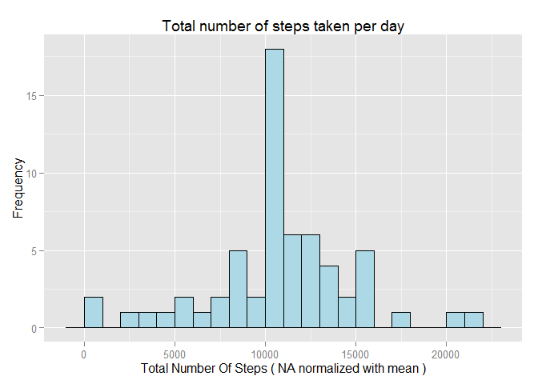

# Reproducible Research: Peer Assessment 1

Introduction
============


This assignament work with data specified in *activity.zip*, this file contains data from a personal activity monitoring device. This device collects data at 5 minute intervals through out the day. The data consists of two months of data from an anonymous individual collected during the months of October and November, 2012 and include the number of steps taken in 5 minute intervals each day.


## Loading and preprocessing the data

*Next code* read data from *activity.zip* as new *data frame* on R with specified column types.

The variables included in this dataset are:

1. **steps**: Number of steps taking in a 5-minute interval (missing values are coded as NA ) 
2. **date**: The date on which the measurement was taken in YYYY-MM-DD format 
3. **interval**: Identifier for the 5-minute interval in which measurement was taken


```r
#unzip data to activity.csv file

unzip("activity.zip",overwrite = TRUE)

#read data and specify default types for columns
   #steps = numeric
   #date = Date
   #interval = numeric

data<-read.csv("activity.csv",header = T,na.strings = c("NA"),colClasses = c("numeric","Date","numeric"))
```

The structure for read data is:


```r
str(data)
```

```
## 'data.frame':	17568 obs. of  3 variables:
##  $ steps   : num  NA NA NA NA NA NA NA NA NA NA ...
##  $ date    : Date, format: "2012-10-01" "2012-10-01" ...
##  $ interval: num  0 5 10 15 20 25 30 35 40 45 ...
```

```r
head(data)
```

```
##   steps       date interval
## 1    NA 2012-10-01        0
## 2    NA 2012-10-01        5
## 3    NA 2012-10-01       10
## 4    NA 2012-10-01       15
## 5    NA 2012-10-01       20
## 6    NA 2012-10-01       25
```


## What is mean total number of steps taken per day?

The next figure show the mean total number of steps taken per day:


```r
#load required libraries
library(dplyr)
```

```
## 
## Attaching package: 'dplyr'
## 
## The following objects are masked from 'package:stats':
## 
##     filter, lag
## 
## The following objects are masked from 'package:base':
## 
##     intersect, setdiff, setequal, union
```

```r
library(ggplot2)

#get data sumarized per dat
sumarized<-data %>% filter(!is.na(steps)) %>% group_by(date) %>% summarize(totalSteps=sum(steps))


#plot mean total number of steps per day
ggplot(sumarized,aes(x=totalSteps))+geom_histogram(binwidth=1000,color="black",fill="lightblue")+labs(title="Total number of steps taken per day",x="Total Number Of Steps",y="Frequency")
```

 


The values for mean and median total number of streps taken per day are:

 *Mean:*
  

```r
mean(sumarized$totalSteps)
```

```
## [1] 10766.19
```

```r
#plot mean total number of steps per day

histplot<-ggplot(sumarized,aes(x=totalSteps))+geom_histogram(binwidth=1000,color="black",fill="lightblue")
histplot<-histplot + labs(title="Mean total number of steps taken per day ( Mean on red line )",x="Total Number Of Steps",y="Frequency")
histplot+geom_vline(aes(xintercept=mean(totalSteps)),color="red",linetype="dashed",show_guide = T) 
```

 
 
 *Median:*

```r
median(sumarized$totalSteps)
```

```
## [1] 10765
```

```r
#plot mean total number of steps per day

histplot<-ggplot(sumarized,aes(x=totalSteps))+geom_histogram(binwidth=1000,color="black",fill="lightblue")
histplot<-histplot + labs(title="Total number of steps taken per day ( Median on yellow line )",x="Total Number Of Steps",y="Frequency")
histplot+geom_vline(aes(xintercept=median(totalSteps)),color="yellow",linetype="dashed",show_guide = T) 
```

 


## What is the average daily activity pattern?

1 Make a time series plot (i.e. type = "l") of the 5-minute interval (x-axis) and the average number of steps taken, averaged across all days (y-axis)

2 Which 5-minute interval, on average across all the days in the dataset, contains the maximum number of steps?


```r
#load required libraries
library(dplyr)
library(ggplot2)

#get data sumarized per dat
sumarized<-data %>% filter(!is.na(steps)) %>% group_by(interval) %>% summarize(meanSteps=mean(steps))

#get max value coordenates
interval = which.max(sumarized$meanSteps)
pointdata = sumarized[interval,]

#plot mean total number of steps per day

histplot<-ggplot(sumarized,aes(x=interval,y=meanSteps))+geom_line(color="black",fill="lightblue")
histplot<-histplot + labs(title="Average Steps by Time Interval",x="5 minute time interval",y="Mean steps number")
histplot<-histplot + geom_point(data=pointdata,aes(x=interval,y=meanSteps),shapes=18,color="red")
histplot#autoprint
```

 

```r
output <- paste("Max Value is:",pointdata[1,2]," on interval ",pointdata[1,1])
print(output)
```

```
## [1] "Max Value is: 206.169811320755  on interval  835"
```


## Imputing missing values

Note that there are a number of days/intervals where there are missing values (coded as NA). The presence of missing days may introduce bias into some calculations or summaries of the data.

1 Calculate and report the total number of missing values in the dataset (i.e. the total number of rows with NAs)


```r
sum(is.na(data$steps))
```

```
## [1] 2304
```


2 Devise a strategy for filling in all of the missing values in the dataset. The strategy does not need to be sophisticated. For example, you could use the mean/median for that day, or the mean for that 5-minute interval, etc.

Create a new dataset that is equal to the original dataset but with the missing data filled in.


```r
data[is.na(data)] <- mean(data$steps,na.rm = T)
```


3 Make a histogram of the total number of steps taken each day and Calculate and report the mean and median total number of steps taken per day. Do these values differ from the estimates from the first part of the assignment? What is the impact of imputing missing data on the estimates of the total daily number of steps?


```r
#load required libraries
library(dplyr)
library(ggplot2)

#get data sumarized per dat
sumarized<-data  %>% group_by(date) %>% summarize(totalSteps=sum(steps))


#plot mean total number of steps per day
ggplot(sumarized,aes(x=totalSteps))+geom_histogram(binwidth=1000,color="black",fill="lightblue")+labs(title="Total number of steps taken per day",x="Total Number Of Steps ( NA normalized with mean )",y="Frequency")
```

 

 
*Mean:*

```r
mean(sumarized$totalSteps)
```

```
## [1] 10766.19
```

```r
#plot mean total number of steps per day

histplot<-ggplot(sumarized,aes(x=totalSteps))+geom_histogram(binwidth=1000,color="black",fill="lightblue")
histplot<-histplot + labs(title="Missing Values Removed",x="Total Number Of Steps",y="Frequency")
histplot+geom_vline(aes(xintercept=mean(totalSteps)),color="red",linetype="dashed",show_guide = T) 
```

 

 
 *Median:*
 

```r
median(sumarized$totalSteps)
```

```
## [1] 10766.19
```

```r
#plot mean total number of steps per day

histplot<-ggplot(sumarized,aes(x=totalSteps))+geom_histogram(binwidth=1000,color="black",fill="lightblue")
histplot<-histplot + labs(title="Missing Values Removed",x="Total Number Of Steps",y="Frequency")
histplot+geom_vline(aes(xintercept=median(totalSteps)),color="yellow",linetype="dashed",show_guide = T) 
```

 

*Question:* After normalize NA values with mean, the mean and the median are almost the same ( median is moved close tho the mean ) and this value, now is greather of value without NA values.

## Are there differences in activity patterns between weekdays and weekends?

For this part the weekdays() function may be of some help here. Use the dataset with the filled-in missing values for this part.

1 Create a new factor variable in the dataset with two levels -- "weekday" and "weekend" indicating whether a given date is a weekday or weekend day.


```r
weekpart = function(x){
  if(x=="Saturday" || x=="Sunday"){
    return('Weekend')
  }
  
  return('Weekday')
}

data$dayname <- weekdays(data$date)
data$daytpe<- as.factor(apply(as.matrix(data$dayname), 1, weekpart))
```


2 Make a panel plot containing a time series plot (i.e. type = "l") of the 5-minute interval (x-axis) and the average number of steps taken, averaged across all weekday days or weekend days (y-axis). The plot should look something like the following, which was created using simulated data:


```r
sumarizedwd = data %>% filter(daytpe=="Weekday") %>% group_by(interval) %>%summarize(meanSteps=mean(steps))
sumarizedwe = data %>% filter(daytpe=="Weekend") %>% group_by(interval) %>%summarize(meanSteps=mean(steps))

library(gridExtra)
```

```
## Warning: package 'gridExtra' was built under R version 3.2.3
```

```r
wdplot<-ggplot(sumarizedwd,aes(x=interval,y=meanSteps))+geom_line(color="black",fill="lightblue")
wdplot<-wdplot + labs(title="Weekday",x="Interval",y="Number of steps")

weplot<-ggplot(sumarizedwe,aes(x=interval,y=meanSteps))+geom_line(color="black",fill="lightblue")
weplot<-weplot + labs(title="Weekday",x="Interval",y="Number of steps")

grid.arrange(wdplot, weplot,nrow=2,ncol=1)
```

 

